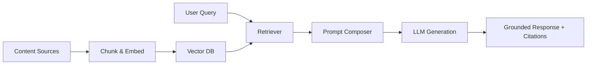

**Definition**
- RAG architectures ground generative models with retrieved context chunks to improve factuality.

**Key Ideas**
- Pipeline steps: chunking, embedding, retrieval, prompt assembly, response.
- Latency depends on vector DB performance and prompt size.
- Evaluation must track grounding citations and hallucination rate.

**Real-World Use Cases**
- Hansard assistant answering parliamentary questions on demand.
- Bank knowledge bots referencing policy PDFs + CRM notes.

**Technologies & Tooling**
- LangChain retrievers with hierarchical chunking.
- Prompt templating via Guidance or Microsoft's Semantic Kernel.
- Vector DBs (Milvus, Weaviate, Pinecone) with ANN indexes tuned for Sinhala/Tamil corpora.

**Related Notes**
- [[ZK-0502 Vector Databases]]
- [[ZK-0301 Large Language Models]]
- [[ZK-0800 AI for Govt]]

**Further Expansion**
- Design RAG blueprint for parliament Hansard search
- Experiment with adaptive chunking for Sinhala script
