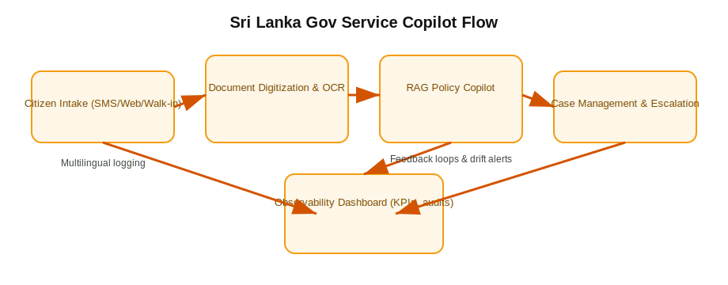

**Definition**
- AI for Sri Lankan government services focuses on digitizing citizen workflows with accountable automation.

**Key Ideas**
- Priority domains: social services, licensing, tax, and disaster response.
- Requires RAG-backed assistants to navigate multilingual records.
- Governance must ensure explainability and audit logs for every inference.

**Real-World Use Cases**
- Launch multilingual virtual agents for Divisional Secretariats.
- Power fraud analytics for public assistance programs.

**Technologies & Tooling**
- GovCloud container platforms with API security gateways.
- Workflow engines (Camunda, n8n) integrating AI decisions.

**Related Notes**
- [[ZK-0704 Sri Lanka Policy Needs]]
- [[ZK-0503 RAG]]
- [[ZK-0601 Prompt Injection]]

**Further Expansion**
- Inventory high-volume forms ripe for copilots
- Design sandbox for inter-ministry data sharing via vector hubs
