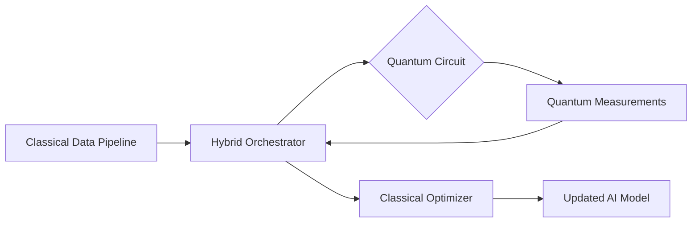

**Definition**
- Quantum-accelerated AI explores how quantum processors, simulators, and quantum-inspired algorithms can speed up or reframe AI training, inference, and security primitives.

**Key Ideas**
- Near-term NISQ devices can support hybrid workflows where classical networks call quantum subroutines for sampling or kernel estimation.
- Fault-tolerant quantum computers promise exponential speedups for optimization and linear algebra at the heart of large-model training.
- Quantum communication and cryptography reshape AI safety by enabling tamper-proof federated learning and secure multi-agent coordination.

**Real-World Use Cases**
- Partner with power-utilities to test quantum-enhanced load forecasting that samples extreme scenarios faster than classical Monte Carlo.
- Run drug-discovery pipelines where variational quantum eigensolvers generate molecular features fed into classical generative models.

**Technologies & Tooling**
- Hybrid toolchains such as Qiskit Runtime, Pennylane, and AWS Braket that orchestrate classical PyTorch models with quantum circuits.
- Quantum-inspired optimizers (e.g., Tensor Networks, D-Wave hybrid solvers) packaged into libraries like QAOA+, Catalyst, or NVIDIA cuQuantum.

**Capability Horizon**
| Dimension | NISQ Era | Fault-Tolerant Era |
| --- | --- | --- |
| Qubit count | < 1000 noisy qubits requiring error mitigation | > 1M logical qubits with full error correction |
| AI impact | Kernel estimation, sampler speedups, combinatorial optimization hints | Native quantum linear algebra, full-model training accelerations |
| Deployment | Cloud-accessed shared devices with queue delays | Dedicated national facilities integrated into HPC centers |

**Related Notes**
- [[ZK-0900 AGI]]
- [[ZK-0903 Long Context Models]]
- [[ZK-0500 GPU & Compute]]

**Further Expansion**
- Map Sri Lankan research collaborations with global quantum labs for shared access time.
- Document benchmarks comparing quantum-kernel methods vs top classical baselines on regional datasets.
